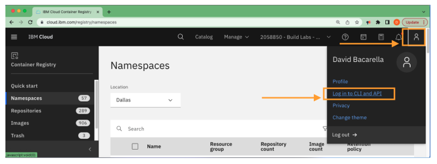
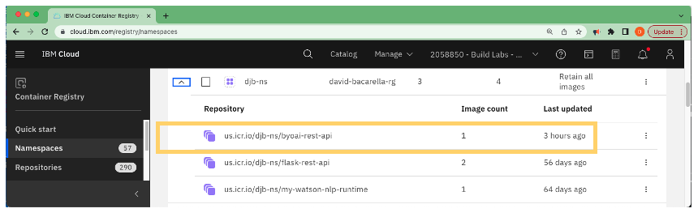
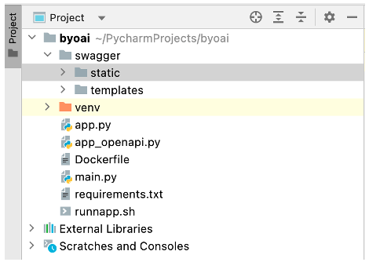

**B.Y.O.AI - Bring Your Own Artificial Intelligence**

Deploy a Python-Flask Web Application using IBM Code Engine

**Use-Case -- Bring your own AI to augment Watson Services**

To augment services with AI and applications in general, it is
advantageous to be able to agnostically call web services to achieve the
desired results. In this TechZone asset, a simple Flask-Python Web
Application will be created and deployed on the IBM Cloud using
Code-Engine. The application will demonstrate the ease in which a
developer can deploy an application on the IBM Cloud using Code-Engine.
Use of Code-Engine allows a developer to focus on their code instead of
the complexities associated with deployment. The development effort is
then taken one step further to demonstrate a way to make the code
OpenAPI 3.0 specification compliant. This allows the REST application to
be called an "extension". Tools such as Watson Assistant and others,
allow for business partners and general users to customize and enhance
native IBM Watson services to incorporate proprietary algorithms making
the IBM service unique and sustainable.

As an example, imagine that a company has a custom AI model (written in
python) to predict the largest loan a person would be qualified to
obtain. The company wants to inform prospective clients with the
information via Watson Assistant Q&A. Using a variety of factors, the AI
produces an amount, and this information is fed back to a person using
the Watson Assistant creating a personalized response to the inquiry.

Once the model is deployed, it can be used in several situations, and in
combination with other AI algorithms. Such implementations can be
integrated into Watson Assistant, Discovery, and several other popular
IBM services. Applications may also be used to augment embedded-AI
providing the proper level of processing needed to achieve an objective.

**Considerations:**

Fast responses to user queries. To address speed, three techniques are
leveraged.

1.  Highly available containerized operations

2.  Asynchronous operations where possible

3.  Parallel processing where applicable

In addition to speed, complex and customized operations can be
implemented out of the box as well.

**Application Build**

To realize the objectives, the first order of business is to build a
simple REST API that is highly available. This will be done using a
Python Flask Web API and deployed onto the IBM Cloud using Code-Engine.
This choice was made because of the rich AI and data processing features
offered by the Python platform, and the capabilities of Code-Engine to
allow developers to focus on code instead of deployment.

**Deploy a simple Flask-Python Web Application using IBM Code Engine**

Each part of the build process will include methods to test operations
before proceeding to the next section.

This objective consists of 5 parts as illustrated below.

1.  Build a REST API using Python Flask

2.  Build and test a docker container (Postman is an alternative to
    docker)

3.  Push the container to the IBM Cloud Registry

4.  Deploy and manage the application using Code-Engine

5.  OpenAPI 3.0 Enablement

**Preface**

This code is available on Git-Hub at the link indicated below.

<https://github.com/ibm-build-lab/Custom-Extensions/tree/main/BYO-AI>

**Special Notes:**

You will notice three files that begin with "app" and with "Dockerfile".
Only app.py and Dockerfile are used at any point in time. The files
containing "-simple" and "-openapi" are placeholders for the code
required at various points in the exercise.

**app-simple.py** and **Dockerfile-simple** -- This is code without the
OpenAPI 3.0 specification. We first construct the application without
the OpenAPI 3.0 specification to demonstrate use of the Code-Engine with
minimal complexity. This file should be copied into the app.py and
Dockerfile, respectively, for the first four exercises.

**App-openapi.py** and **Dockerfile-openapi** -- This file contains the
code using the OpenAPI 3.0 specification. The code should be copied into
app.py and Dockerfile, respectively, when step 5 is reached.

I.  **Build a REST API using Python Flask**

It is assumed that the reader has deep programming experience to handle
the set-up of local environments. This tutorial demonstrates application
creation using PyCharm; however, you may use whatever editor you feel
most comfortable with.

1.  Create a folder for the new application. Call it "byoai".

2.  Create a file called app.py (this is considered a best practice) and
    populate the file with the following code.

> The code uses the \@app.route decorator to specify the available API
> calls, and the code to handle the request.
>
> Assume that the site will respond to <https://localhost:5000> and
> subsequently defined site branches.

```
from flask import Flask, request, jsonify   # Import necessary packages  
PORT = 5000					    # Specify the port the server will respond to  
app = Flask(__name__)			# Define the app variable  
languages = ["English", "Spanish", "French", "German", "Italian", "Portuguese", "Swedish"]  
    
@app.route("/")				    # Handle the site home address  
def home():  
    return jsonify({"status": "online"})    # Return site status of online  

@app.route("/languages")	    # Return list of languages  
def get_languages():  
    return jsonify({"languages": languages})  

if __name__ == "__main__":	    # Start the server or listener operation  
    app.run(debug=True, host="0.0.0.0", port=PORT)  
```

3.  Create a file called "requirements.txt" and paste in the following
    code. This is used by the Dockerfile to pull in the Python
    dependencies.
    
```
Flask==2.2.3  
Flask-JSON==0.3.5  
```

4.  Create a file called "runapp.sh" and paste in the following code.
    This is used by the docker container to start the flask service.
    
```
export FLASK_APP=app  
flask run  
```

5.  Create a file called "Dockerfile" and paste in the following code.
    Note the use of "requirements.txt" within the file. Also, note pip3
    imports include what is in the requirements.txt file.

> Note: Use of ubi8 from RedHat to provide the best of breed container
> security. Please refer to the following link for additional
> information.
>
> <https://www.redhat.com/en/blog/introducing-red-hat-universal-base-image>

```
FROM registry.access.redhat.com/ubi8/python-39  

# Add application sources with correct permissions for OpenShift  
USER 0  
ADD app-src .  
RUN chown -R 1001:0 ./  
USER 1001  
  
WORKDIR /app  

COPY ./requirements.txt .  
  
RUN pip install -U "pip>=19.3.1"   
RUN pip3 install -r requirements.txt  
  
COPY . .  
ENV FLASK_APP=app  
EXPOSE 5000  
  
CMD python app.py runserver 0.0.0.0:5000  
```

**Operation Checks:**

1.  The workspace created should look like what is highlighted by the
    orange box.

{width="6.5in"
height="4.372222222222222in"}

2.  Run the application. Open a terminal instance and run "python3
    app.py" as shown in the illustration below.

{width="6.275938320209974in"
height="4.102828083989501in"}

3.  The terminal will respond with something like below. Notice that the
    server is running on <http://127.0.0.1:5000>. Since the server is
    running the prompt is no longer available.

{width="6.083333333333333in"
height="1.7638888888888888in"}

4.  Open a browser and test using the following two URLs.

-   <http://localhost:5000>

-   <http://localhost:5000/languages>

> Respectively, you should see the following output or something very
> similar


```
{
  "status": "online"
}
```

```
{
  "Language_list": [
    {
      "language": "English"
    },
    {
      "language": "Spanish"
    },
    {
      "language": "French"
    },
    {
      "language": "German"
    },
    {
      "language": "Italian"
    },
    {
      "language": "Portuguese"
    },
    {
      "language": "Swedish"
    }
  ]
}
```


II. **Build and Test Docker container**

> Providing docker is installed and other environmental requirements are
> satisfied, execute the following steps.

1.  Run the following command to build the docker image.

```
> ../ byoai % docker build -t byoai-rest-api .
```

2.  Run the container image using the following command.

```
> ../ byoai % docker run -p 5000:5000 -it byoai-rest-api
```

3.  Open a browser and test using the following two URLs. Notice that we
    mapped the localhost port of 8080 to the container's port of 5000.

-   <http://localhost:8080>

-   <http://localhost:8080/languages>

> Respectively, you should see the following output.

```
{
  "status": "online"
}
```

```
{
  "languages": [
    "English",
    "Spanish",
    "French",
    "German",
    "Italian",
    "Portuguese",
    "Swedish"
  ]
}
```


III. **Push image to the IBM Container Registry**

This process requires that basic set up of the IBM container registry
has already taken place.

1.) Login to the IBM Cloud and select the "Container Registry"
resource as shown below.

{width="6.5in" height="3.9in"}

2.) Check the Container Registry Namespace and document the following
information. The information provided below is to provide an example
of the information needed. Be sure to save the information so that it
can be accesses later.

> Notes:
>
>-   The "repository" corresponds to one program being deployed and each
>    of its versions.
>-   Make sure you are in the desired "Location". In this case, Dallas is
>    the location of interest.

**Registry Name:** us.icr.io  
**Namespace Name:** djb-ns  
**Resource Group:** david-bacarell-rg  
**Common Path:** us.icr.io/djb-ns/[repository-name] <-- The docker image that will be pushed image that will be pushed   


{width="6.4569455380577425in"height="3.5616688538932633in"}

3.) Find the local image to be pushed.

Find the local image using the following command on the local machine. The output should be similar to what is shown below.

```
../ byoai % docker images \| grep byoai-rest-api
```

```
byoai-rest-api           latest                     b8d9a08180e5   2 days ago      922MB
```

4.) Tag the image for the destination repository.

Set up environment variables for convenience:

```
../byoai% export REGISTRY=us.icr.io  <-- information from step 2
../byoai% export NAMESPACE=djb-ns <-- information from step 2
```
> Note: The name of the image created is the first parameter after the
> tag subcommand. Notice that the image is being tagged to create a
> repository with a versioned image.
```
../byoai% docker tag byoai-rest-api/${REGISTRY}/${NAMESPACE}/byoai-rest-api:1.0  
```

Rerun the following command and observe teh tagged image.

```
../byoai% docker images | grep byoai-rest-api
```
```
byoai-rest-api 			        latest            b8d9a08180e5   2 days ago      922MB
icr.io/djb-ns/byoai-rest-api 	1.0               b8d9a08180e5   2 days ago      922MB
```

5.) Login to the IBM Cloud CLI and repository

   a. Click on the "person" icon and then click on the "Log in to CLI
   and API" to get the CLI command to log in with. It will look like what
   is shown below

```
   ../byoai% ibmcloud login -a https://cloud.ibm.com -u passcode -p abcdefghij
```

 
 {width="5.4523261154855645in" height="1.9677307524059493in"}

 b. Select the appropriate region from the list presented.

 c. Set the target resource group as appropriate

```
 ../byoai% ibmcloud target -g david-bacarella-rg
```

 d. Ensure you are targeting the correct IBM Cloud Container Registry
 region.

```
 ../byoai% ibmcloud cr region-set us-south
```

 e. Log in to the IBM Could Container Registry.

``` 
 ../byoai% ibmcloud cr login
```

6.) Push the tagged image to the registry which creates the
    repository. It creates the repository within the namespace which is in
    the registry.  

```
../byoai% docker push ${REGISTRY}/${NAMESPACE}/byoai-rest-api:1.0 
```

7.) Check the IBM Cloud Registry. The uploaded container should be visible.  


{width="6.5in" height="1.9180555555555556in"}


IV. **Deploy and manage the application using Code-Engine**

It is assumed that the reader is an experienced programmer and has
access to and is familiar with the basic operations of the IBM Cloud.

1.  Open the IBM Code Engine as shown below. Select \[Overview\]

{width="4.9071708223972in"
height="3.2536220472440944in"}

2.  Select the \[Start Creating\] menu option as shown below.

> {width="4.892896981627296in"
> height="2.920571959755031in"}

3.  Create an "Application", provide a unique name for the application,
    and either create a new project or select an existing one. In this
    case, the preexisting project called "code-engine-alpha" is being
    used.

> {width="6.5in"
> height="4.214583333333334in"}

4.  Scroll down to the next section as shown below. Ensure "Container
    image" is selected. Specify the image reference, and make sure you
    specify the port exposed in the Dockerfile configuration file. The
    port is essential.

> Select the "Configure image" button to the right the "Image reference"
> field.
>
> Note: Recall the information collected in step 3
>
> **Registry Name:** us.icr.io
>
> **Namespace Name:** djb-ns
>
> **Resource Group:** david-bacarell-rg
>
> **Common Path:** us.icr.io/djb-ns/\[*repository-name*\] The docker
> image that will be pushed
>
> {width="6.5in"
> height="4.529861111111111in"}

5.  Be sure to create a new registry access key if needed. Just select
    the option and follow the prompts. Ensure the values for Registry
    server, Namespace, Repository, and Tag are what is expected. Then
    click "Done".

> {width="6.5in"
> height="4.172916666666667in"}

6.  The application is deployed. Upon completion, test the application.
    Select the "Send request" button and observe the response. An
    example of what you should see is below.

> Note: The response is "{"status": "online}" just as we found in the
> step 1 of the procedure.

{width="6.5in" height="4.397916666666666in"}

7.  Click on the "Open URL" option.

> {width="4.833265529308837in"
> height="2.129012467191601in"}

8.  Add "/languages" to the end of the URL and hit the enter key.

> {\"languages\":\[\"English\",\"French\",\"German\",\"Italian\",\"Portuguese\",\"Swedish\"\]}

V.  **Open API 3.0 Enablement**

> Open API 3.0 enablement consists of augmenting the REST service to
> comply with the Open API 3.0 standard. Open API 3.0 (formerly known as
> Swagger) is a standard for computer-to-computer documentation of a
> REST interface. This allows programs to extend their capabilities with
> little to no code modifications. An example of this can been seen
> using Watson Assistant. One can "extend" Watson Assistant using an
> Open API 3.0 compliant interface. The user of the extension need only
> reference one of the API routes directly in the Watson GUI.
>
> To demonstrate, the simple REST API developed earlier will be
> augmented. One can use several available options to implement the Open
> API 3.0 specifications. This is one way to do it.
>
> **Note:** You can copy app-openapi.py to app.py and Dockerfile-openapi
> to Dockerfile respectively. However, it is a good exercise to manually
> make these modifications so that you will have a good basis for more
> complex configurations.
>
> 1.) Add required libraries -- Each of the libraries serves a specific
> purpose in the creation of an Open API 3.0 specification. If
> interested in more detail, please research them on-line.
>
> **from** apispec **import** APISpec\
> **from** apispec.ext.marshmallow **import** MarshmallowPlugin\
> **from** apispec_webframeworks.flask **import** FlaskPlugin\
> **from** flask **import** Flask, jsonify, render_template,
> send_from_directory\
> **from** marshmallow **import** Schema, fields\
> **from** werkzeug.utils **import** secure_filename
>
> The original code is provided for reference below.
>
> 2.) Change the app variable and add the spec variable as shown below.
>
> app = Flask(\_\_name\_\_, template_folder=**\'./swagger/templates\'**)
>
> spec = APISpec(\
> title=**\'flask-api-swagger-doc\'**,\
> version=**\'1.0.0\'**,\
> openapi_version=**\'3.0.2\'**,\
> plugins=\[FlaskPlugin(), MarshmallowPlugin()\]\
> )
>
> **Operation Check:** The code should look like this now.
>
> 3.) Add routes for Open API access as shown below.
>
> \@app.route(**\'/api/swagger.json\'**)\
> **def** create_swagger_spec():\
> **return** jsonify(spec.to_dict())
>
> \@app.route(**\"/docs\"**)
>
> \@app.route(**\"/docs/\<path:path\>\"**)\
> **def** swagger_docs(path=**None**):\
> **if not** path **or** path == **\'index.html\'**:\
> **return** render_template(**\'index.html\'**,
> base_url=**\'/docs\'**)\
> **else**:\
> **return** send_from_directory(**\'./swagger/static\'**,
> secure_filename(path))

4.) Add marshmallow support by adding the following section of code.

Marshmallow is a python package that specifically handles data

serialization and deserialization.

> *\# Marshmallow support\
> ***class** LanguageResponseSchema(Schema):\
> language = fields.Str()
>
> 5.) Add a class definition for the language route response.
>
> **class** LanguageResponse(Schema):\
> language_list = fields.List(fields.Nested(LanguageResponseSchema))
>
> 6.) For each route, document feature as necessary. For this example,
> the
>
> specification is quite simple; however, more complex definitions will
>
> be required for most applications. Leave the "/" route unaffected by
>
> change.
>
> \@app.route(**\"/languages\"**)\
> **def** get_languages():
>
> *\"\"\"Get list of **languages**\
> \-\--\
> get:\
> description: Get list of languages\
> responses:\
> 200:\
> description: Return a language **list**\
> content:\
> application/json:\
> schema: LanguageResponse\
> \"\"\"*
>
> languages = \[\
> {**\"language\"**: **\"English\"**},\
> {**\"language\"**: **\"Spanish\"**},\
> {**\"language\"**: **\"French\"**},\
> {**\"language\"**: **\"German\"**},\
> {**\"language\"**: **\"Italian\"**},\
> {**\"language\"**: **\"Portuguese\"**},\
> {**\"language\"**: **\"Swedish\"**}\
> \]
>
> **return** LanguageResponse().dump({**\"language_list\"**: languages})
>
> **Operation Check**: The code should look like as shown below.
>
> 7.) Leave the following route unaffected by change. When the code is
>
> tested, it will be observed that this function will work; however,
>
> it will not be seen by the OpenAPI tools.
>
> \@app.route(**\"/\"**)\
> **def** home():\
> **return** jsonify({\
> **\"status\"**: **\"online\"\
> **})
>
> 8.) Add the following to which registers the API. Note the "view"
>
> variable. It is given the value of the name of the function defined
>
> under the language route.
>
> *\# Register API\
> ***with** app.test_request_context():\
> spec.path(view=language_listing)
>
> 9.) Add the following to the bottom of the file.
>
> **if** \_\_name\_\_ == **\"\_\_main\_\_\"**:\
> app.run(debug=**True**, host=**\"0.0.0.0\"**, port=PORT)
>
> 10.) Add swagger subdirectory to your project. This should be created
> at
>
> the level where the app.py file resides. Under the swagger directory,
>
> create two directories named static and templates respectively.
>
> Note: Recall the following line of code.
>
> [app = Flask(\_\_name\_\_,
> template_folder=**\'./swagger/templates\'**)]{.mark}
>
> Notice that the directory structure you just created is specified in
>
> the app definition.
>
> {width="3.5883552055993in"
> height="2.5618788276465443in"}
>
> 11.) Copy files within "static" and "templates" directories from the
> GitHub repository located at the following link.
>
> <https://github.com/ibm-build-lab/Custom-Extensions>
>
> 12.) Modify the ./swagger/static/initializer.js file.
>
> a\. Set the url to the URL where the code will run. In this case, the
>
> the code is configured to run on a local machine.
>
> 13.) Modify the ./swagger/templates/index.html file as shown below.
>
> 14.) Test -- Run the application, and then access the following links
> using a browser. Representative screen shots are provided.
>
> a\. http://localhost:5000/
>
> This route is unknown to the OpenAPI tooling. Note that it is still
> responsive.
>
> {width="5.727060367454068in"
> height="2.287153324584427in"}
>
> b\. <http://localhost:5000/languages>
>
> This link provides results for the main route of the application.
>
> {width="5.7784930008748905in"
> height="3.0182753718285213in"}
>
> c\. <http://localhost:5000/docs>
>
> Enter the world of swagger.
>
> {width="5.123836395450569in"
> height="3.0704691601049867in"}
>
> d\. Click on the "Get" button, and then click on the "Try it out"
> button. Afterwards, click on the "Execute" button.
>
> {width="6.143314741907262in"
> height="3.5947583114610673in"}

15\. Deploy the application using steps 1 through 4 to see it working on
the Cloud. Simply

> change the tag to 2.0 to retain both versions of the container.
